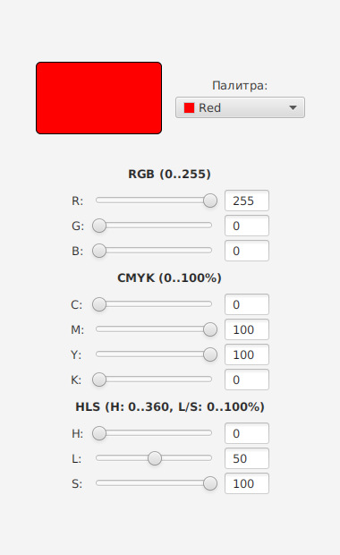

# Лабораторные работы по компьютерной графике

**Мацуков Владимир Александрович**

## Лабораторная работа 1 — Цветовые модели

Вариант 2: **RGB ↔ CMYK ↔ HLS**.

Приложение на JavaFX позволяет задавать цвет с помощью полей ввода, ползунков и палитры ColorPicker. Представления цвета в трёх моделях пересчитываются при изменении компонент.

Проект находится в папке [lab_1](lab_1). Краткий отчёт: [Report_Matsukov.docx](lab_1/Report_Matsukov.docx).

### Инструменты

- Java: **JDK 26**, как указано в исходном `pom.xml`.
- JavaFX 21.0.6.
- FXML для интерфейса.
- Maven; Maven Wrapper уже включён в проект.

### Запуск в IntelliJ IDEA

1. Скачайте репозиторий: **Code → Download ZIP**, затем распакуйте архив.
2. В IDEA выберите **File → Open** и откройте папку `lab_1` с файлом `pom.xml`.
3. Выберите JDK 26 в **File → Project Structure → Project SDK**. В настройках Maven также укажите этот JDK для Runner и Importer.
4. Загрузите Maven-проект и дождитесь скачивания зависимостей.
5. Откройте окно Maven → Plugins → javafx → javafx:run.

Запуск из PowerShell, открытого в папке `lab_1`:

```powershell
.\mvnw.cmd clean javafx:run
```

Из терминала Linux/macOS:

```sh
sh mvnw clean javafx:run
```

Отдельная установка Maven не нужна. При первом запуске требуется интернет; JavaFX скачивается автоматически.

### Состав проекта

- `HelloApplication.java` — создание окна и загрузка FXML.
- `HelloController.java` — обработчики ввода и формулы преобразования цветов.
- `Launcher.java` — дополнительная точка входа.
- `hello-view.fxml` — описание элементов интерфейса.
- `module-info.java` — зависимости Java-модуля.
- `pom.xml` — зависимости и настройки Maven.

RGB задаётся в диапазоне 0–255; CMYK и L/S — 0–100%; H — 0–360°. В математических формулах процентные компоненты делятся на 100. Для чёрного цвета предусмотрена отдельная обработка K=1.

### Состояние реализации

Это версия из исходного проекта ColorConverter. Выбор UCR/GCR, динамические градиенты, отдельный математический слой и автоматические тесты в ней пока не реализованы. Зависимости JUnit присутствуют в `pom.xml`, но тестовых классов нет. Windows EXE не включён.

### Интерфейс


